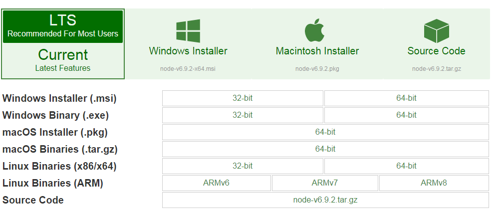

# Node.js
>Node.js 是一个基于Chrome JavaScript 运行时建立的一个平台， 用来方便地搭建快速的， 易于扩展的网络应用· Node.js 借助事件驱动， 非阻塞 I/O 模型变得轻量和高效， 非常适合 run across distributed devices 的 data-intensive 的实时应用。

# win下安装Node.js

# 1.下载Node.js

直接到nodejs官网下载 [点击这里下载](https://nodejs.org/en/download/)。


>选择mis格式点击安装即可

# 2.node 升级
>node有一个模块叫n（这名字可够短的。。。），是专门用来管理node.js的版本的。

首先安装n模块：
``` bash
 npm install -g n

```

升级node.js到最新稳定版
``` bash
 n stable
 
```
n后面也可以跟随版本号比如：
``` bash
 n v0.10.26
 
```

# 3.npm 升级
升级方法
>1.使用 `npm -g install npm@2.9.1` （版本号2.9.1 可以根据已发布的版本随意升级或降级），获取最新版本的npm 文件

>2.然后复制C:\Users\{你的Windows用户名}\AppData\Roaming\npm\node_modules\npm下的文件到你的 NodeJS安装目录下的 \node_modules\npm 中，覆盖掉原有的全部文件；

常用npm命令
``` bash
npm -v          #显示版本，检查npm 是否正确安装。
npm install express   #安装express模块
npm install -g express  #全局安装express模块
npm list         #列出已安装模块
npm show express     #显示模块详情
npm update        #升级当前目录下的项目的所有模块
npm update express    #升级当前目录下的项目的指定模块
npm update -g express  #升级全局安装的express模块
npm uninstall express  #删除指定的模块

```

